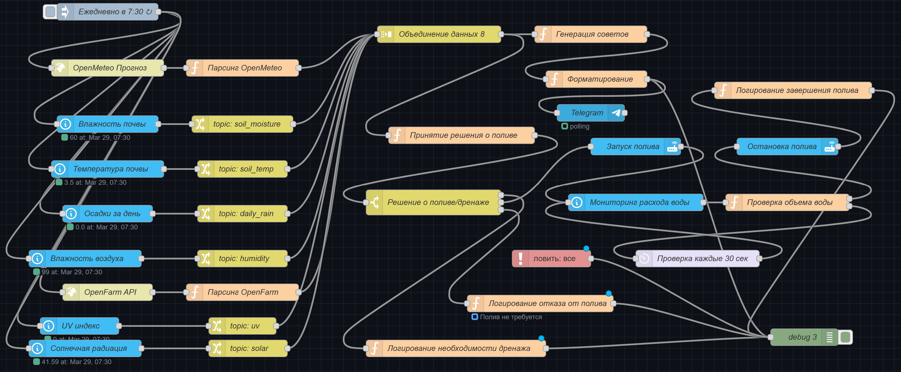

# Система автоматического полива газона 🌱

## Описание

Система автоматического полива газона, построенная на Node-RED и Home Assistant. Проект позволяет автоматизировать процесс полива газона на основе данных от различных датчиков, погодных условий и рекомендаций OpenFarm. Система также включает управление дренажной системой и отправку ежедневных рекомендаций через Telegram-бота.

### Основные возможности

- 🤖 Автоматический полив на основе комплексного анализа данных
- 🌡️ Мониторинг температуры и влажности почвы через датчики
- 🌧️ Учет осадков и прогноза погоды из OpenMeteo
- 🌱 Рекомендации по поливу из OpenFarm
- 💧 Управление дренажной системой
- 📱 Удобное управление через Home Assistant
- 📊 Визуализация данных и статистики
- ⚙️ Гибкая настройка параметров полива
- 📬 Ежедневные рекомендации через Telegram

### Логика принятия решений

Система принимает решение о поливе на основе следующих факторов:

1. **Данные с датчиков**:
   - Влажность почвы (WH51)
   - Температура почвы (WH31)
   - UV индекс (WS2350)
   - Солнечная радиация (WS2350)
   - Осадки (WS2350)
   - Температура воздуха (WS2350)
   - Влажность воздуха (WS2350)
   - Пороговые значения для каждого параметра

2. **Прогноз погоды** (OpenMeteo):
   - Ожидаемые осадки
   - Риск заморозков
   - Испаряемость (ET0)

3. **Рекомендации OpenFarm**:
   - Оптимальная влажность для растений
   - Рекомендуемое время полива
   - Специфические требования к поливу
   - Рекомендации по внесению удобрений

4. **Управление дренажной системой**:
   - Автоматическое включение при сильных осадках или высокой влажности почвы
   - Система активируется только в отсутствие заморозков
   - Мониторинг уровня воды
   - Защита от затопления

5. **Временные ограничения**:
   - Полив только с 6:00 до 8:00
   - Максимальная длительность полива 2 часа
   - Учет солнечной активности
   - Сезонные корректировки

### Ежедневные рекомендации

Система отправляет в Telegram следующие данные:
- Текущее состояние почвы
- Прогноз погоды на день
- Рекомендации по поливу
- Рекомендации по внесению удобрений
- Предупреждения о заморозках
- Статус дренажной системы
- Предупреждения о необходимости ручного вмешательства

## Схема потока Node-RED

Основная логика системы реализована в виде потока Node-RED:



## Структура проекта

```
lawn-irrigation/
├── node-red/
│   └── flows/
│       └── agro.json      # Node-RED flow для управления поливом
├── home-assistant/
│   ├── configuration/
│   │   └── wfc01.yaml    # Конфигурация контроллера полива
│   └── lovelace/
│       └── button.yaml    # Карточка управления поливом
├── config.example.yaml    # Переменные конфигурации
└── docs/
    └── setup.md          # Подробные инструкции по установке
```

## Предварительные требования

### Программное обеспечение
- Home Assistant (версия 2023.1 или выше)
- Node-RED (установленный как Home Assistant add-on)

### Аппаратное обеспечение
- Метеостанция Ecowitt WS2350_V2.37 со встроенными датчиками:
  - Температуры воздуха
  - Влажности воздуха
  - UV индекса
  - Солнечной радиации
  - Осадков
- Шлюз Ecowitt GW2000A
- Контроллер полива Ecowitt WFC01
- Внешние датчики:
  - Влажности почвы (Ecowitt WH51)
  - Температуры почвы (Ecowitt WH31)

## Установка и настройка

Подробные инструкции по установке и настройке системы доступны в [docs/setup.md](docs/setup.md)

## Лицензия

MIT License - свободное использование и модификация проекта.

## Автор

Stanley Wilson

---
⭐ Если проект был полезен, не забудьте поставить звездочку!