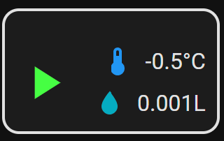

# Инструкция по установке системы автоматического полива

## 📋 Проверка предварительных требований

Перед началом установки убедитесь, что:

1. ✓ У вас установлен Home Assistant версии 2023.1 или выше
2. ✓ Node-RED установлен и работает как дополнение Home Assistant
3. ✓ Все датчики подключены и работают корректно
4. ✓ Есть доступ к Telegram для создания бота
5. ✓ Контроллер полива подключен к сети

## 🚀 Пошаговая установка

## Требования к оборудованию и програмному обеспечению

1. Установленный Node-RED (версия 3.0 или выше)
2. Установленный Home Assistant (версия 2023.1 или выше)
3. Контроллер полива Ecowitt WFC01
4. Метеостанция Ecowitt WS2350_V2.37
5. Шлюз Ecowitt GW2000A
6. Датчики:
   - Влажности почвы (Ecowitt WH51)
   - Температуры почвы (Ecowitt WH31)
   - UV индекса (встроен в WS2350)
   - Солнечной радиации (встроен в WS2350)
   - Осадков (встроен в WS2350)
   - Температуры воздуха (встроен в WS2350)
   - Влажности воздуха (встроен в WS2350)
7. Telegram бот (для уведомлений)

## Шаг 1: Настройка Home Assistant

1. Откройте файл конфигурации Home Assistant (`configuration.yaml`)
2. Включите содержимое файла в основной файл `home-assistant/configuration/wfc01.yaml`
3. установить Ecowitt интеграцию 
4. Перезапустите Home Assistant

## Шаг 2: Настройка интерфейса

1. Откройте Lovelace в Home Assistant
2. Добавьте новую карточку
3. Вставьте содержимое файла `home-assistant/lovelace/button.yaml`
4. Сохраните изменения

> **Примечание**: В проекте используется нестандартная карточка Lovelace для управления поливом. Она предоставляет расширенный функционал по сравнению со стандартными карточками Home Assistant, включая отображение статуса полива, прогресса и дополнительных параметров.

### Внешний вид карточки управления поливом

После настройки в интерфейсе Home Assistant появится следующая карточка управления:

Карточка позволяет:
- Запускать и останавливать полив вручную
- Отслеживать прогресс текущего полива
- Видеть статус системы полива
- Контролировать расход воды в реальном времени

## Проверка работы Home Assistant

1. В Home Assistant должна появиться карточка управления поливом
2. Протестируйте ручное включение полива

## Диагностика Home Assistant

1. Убедитесь, что все датчики доступны в WS2350 и GW2000A

## Шаг 3: Настройка Node-RED

> **Важно**: Перед началом настройки необходимо установить следующие модули в палитру Node-RED:
> - `node-red-contrib-telegrambot` - для отправки уведомлений через Telegram- для работы с датами и временем
> - `node-red-contrib-home-assistant-websocket` - для интеграции с Home Assistant

1. Откройте Node-RED через Home Assistant (Дополнения -> Node-RED)
2. Перейдите в меню (три точки в правом верхнем углу)
3. Выберите "Insert"-"Импорт"
4. Загрузите файл `node-red/flows/agro.json`
5. Нажмите "Импорт"
6. Настройте Telegram бота:
   - Добавьте ноду "telegram bot"
   - Введите токен вашего бота
   - Укажите ID чата для уведомлений (ID групповых чатов начинаются с -100)

## Шаг 4: Настройка конфигурационных параметров

> **Важно**: Следующие параметры необходимо изменить непосредственно в вашем потоке Node-RED, а не в отдельном файле.

В потоке Node-RED найдите и настройте следующие параметры:
- IP-адрес шлюза GW2000A
- ID контроллера WFC01
- Параметры Telegram бота
- Координаты для OpenMeteo API
- Параметры полива:
  - Площадь газона (по умолчанию 300 м²)
  - Минимальный объем воды (8 л/м²)
  - Максимальный объем воды (17 л/м²)
  - Максимальная длительность полива (120 минут)
- Пороговые значения:
  - Влажность почвы: < 40% для полива
  - Точка росы: < 15°C для полива и стрижки
  - Скорость ветра: < 15 км/ч для полива и стрижки
  - UV индекс: < 2 для полива
  - Солнечная радиация: < 100 Вт/м² для полива
  - Температура почвы: > 5°C для удобрений и стрижки
  - Влажность воздуха: < 80% для стрижки
  - Осадки: < 5 мм для полива, < 1 мм для удобрений
  - Испаряемость (ET0): > 3 для полива

## Проверка работы Node-RED

1. В Node-RED должны быть активны все ноды
2. Проверьте получение данных от всех датчиков
3. Проверьте работу Telegram бота
4. Проверьте автоматическое отключение полива по достижении целевого объема

## Диагностика Node-RED

1. Проверьте логи Node-RED на наличие ошибок
2. Проверьте подключение к контроллеру WFC01
3. Проверьте корректность настроек в потоке Node-RED
4. Проверьте работу Telegram бота
5. Проверьте доступность OpenMeteo API
6. Проверьте работу OpenFarm API

## 🔍 Диагностика и устранение проблем

### Проблемы с Home Assistant

| Проблема | Решение |
|----------|---------|
| Датчики не отображаются | Проверьте подключение к шлюзу GW2000A |
| Ошибка интеграции | Перезапустите Home Assistant |
| Карточка не отображается | Проверьте конфигурацию Lovelace |

### Проблемы с Node-RED

| Проблема | Решение |
|----------|---------|
| Ошибка импорта потока | Проверьте версию Node-RED |
| Telegram бот не отвечает | Проверьте токен и ID чата |
| Ошибки в логах | Включите режим отладки |

## ✅ Проверка работоспособности

После установки выполните следующие проверки:

1. [ ] Все датчики отправляют данные
2. [ ] Telegram бот отправляет уведомления
3. [ ] Ручное управление поливом работает
4. [ ] Автоматическое расписание активно
5. [ ] Дренажная система реагирует на изменения 